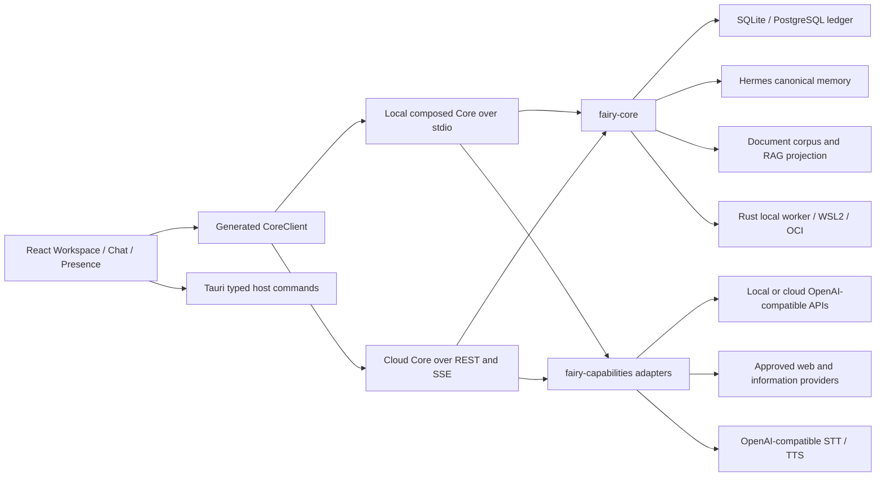

# Fairy V3 Assistant Capabilities Design

**Status:** Accepted implementation specification

**Date:** 2026-07-11

## Purpose

This specification completes the product architecture after the durable Core,
Hermes memory, synchronization, Runtime, and static Preview milestones. It
defines the remaining assistant, information, document, voice, perception,
Presence, and system-action capabilities without weakening the existing
Project, Task, Scope, Command Bus, or ledger invariants.

The implementation must produce a useful offline shell when providers are not
configured. Provider-backed controls remain visible with an explicit
unavailable state. No capability silently falls back to a host shell, browser
speech synthesis, an unscoped network client, or a second memory authority.

## Product outcomes

Fairy V3 supports both of these first-class workflows:

1. Scratch conversation: every user turn creates a scratch Task, binds an
   immutable Hermes Snapshot, and produces durable Messages and a Turn.
2. Project execution: every user turn is bound to the selected Project,
   Conversation, Task, Version, execution target, and Scope. Model-proposed
   tools cross the Command Bus and write only to the candidate Version.

Both workflows use the same assistant state machine, model-provider ports,
tool registry, durable event stream, and generated CoreClient contracts.

## Component boundary



### `fairy-core`

Core owns domain state, application state machines, provider ports, Tool
Definitions, Scope injection, policy decisions, command runs, durable events,
Messages, Turns, Tool Invocations, document metadata, and RAG provenance. It
continues to depend only on Pydantic and SQLAlchemy.

Core never imports HTTP clients, model SDKs, document parser libraries, audio
codecs, Tauri APIs, or operating-system capture APIs.

### `fairy-capabilities`

The new Python package owns replaceable external adapters and composition:

- OpenAI-compatible chat, multimodal, transcription, and speech clients;
- Brave Search and News clients;
- constrained HTTP fetch;
- Open-Meteo geocoding and weather;
- Frankfurter exchange rates;
- Alpha Vantage stocks and digital assets;
- PDF and DOCX extraction;
- local stdio composition and cloud adapter factories.

It depends on `fairy-core`; Core never depends on it. Tauri launches
`fairy_capabilities.stdio` for the product process. The original
`fairy_core.transports.stdio` remains a provider-free Core contract fixture.

### Desktop and Tauri

React owns rendering and input only. Tauri owns windows, OS credentials,
screen capture, audio-device access, and typed host actions. A renderer cannot
read a provider secret after writing it. Presence and Guide windows cannot
call Core RPC or capture the screen. Only the main window can request an
assistant turn, capture, or host action.

### Rust workers

The local worker remains the only local project filesystem authority. Generic
model-directed commands remain restricted to the attested WSL2 FairySandbox.
Typed host actions are a separate executor and never accept a program name,
argument vector, command line, script, or shell fragment from a model.

## Durable assistant model

### Entities

`Message` is an immutable conversation record with:

- UUIDv7 ID and Conversation, Task, and optional Turn IDs;
- role: `user`, `assistant`, `tool`, or `system_notice`;
- visibility: `user`, `developer`, or `internal`;
- ordered sequence within the Conversation;
- complete public content or a canonical content reference;
- creation timestamp.

Internal prompts and model reasoning are not Messages. Tool arguments are
stored in a restricted Tool Invocation record and redacted from user-visible
events.

`AssistantTurn` binds one Task, model profile, model capability snapshot,
Scope digest, Hermes Snapshot ID/hash, status, cancellation revision, usage,
error code, and timestamps. The status graph is:

```text
created -> running -> waiting_for_tool -> running -> completed
                    -> cancelled
                    -> failed
created -> cancelled
```

Terminal Turns cannot restart. A retry creates a new Turn and idempotency key.

`ToolInvocation` binds one Turn, sequence, registered tool name, Core-generated
Scope digest, canonical argument hash, CommandRun ID, status, bounded public
summary, and optional Artifact IDs. It never trusts model-supplied Project,
Conversation, Task, Version, path-root, network-policy, or Memory identifiers.

### Transaction boundaries

Starting a Turn commits the user Message, Task binding, Turn, and visible
`assistant.turn.started` event atomically. Each public text delta is a durable,
monotonic `assistant.message.delta` event with Turn sequence and chunk index.
Completion atomically commits the final assistant Message, terminal Turn,
usage, and `assistant.turn.completed` event.

After recovery, a `running` or `waiting_for_tool` Turn without a live lease is
marked `WORKER_INTERRUPTED`; it is never replayed automatically. Idempotent
tool Commands may be resumed through their existing CommandRun keys.

## Model-provider contract

Core defines provider-neutral request, delta, tool-candidate, usage, health,
and cancellation types. A provider profile contains only non-secret fields:

- stable profile ID and display name;
- base URL and model ID;
- provider kind: `openai_compatible` or `local_openai_compatible`;
- supported text, tools, vision, STT, and TTS capabilities;
- timeout and explicit fallback profile ID;
- enabled state.

API keys are credential references. Local desktop secrets are stored by the
Tauri credential adapter and injected into the child process environment only
for the configured provider reference. Cloud secrets are injected from the
deployment secret store. They are never persisted in SQLite/PostgreSQL,
returned by CoreClient, written to logs, placed in model context, or included
in an Artifact.

Provider fallback occurs only when the selected profile explicitly names a
fallback and the requested modalities are supported. Cancellation closes the
upstream response and prevents later deltas from entering the ledger.

## Assistant routing and tools

The model receives the capability manifest plus an always-available
`direct_answer` option. No keyword router chooses weather, news, memory,
research, or project tools. A model tool call is an untrusted candidate. Core:

1. resolves the Task and immutable Scope;
2. validates arguments against the Tool Definition schema;
3. drops all model-supplied scope fields;
4. asks policy for approval or rejection;
5. persists the CommandRun before dispatch;
6. invokes the selected adapter;
7. commits the result summary, Artifacts, events, and Command completion;
8. returns bounded, source-labelled data to the model.

At most eight tool invocations and three model rounds are allowed per Turn.
Repeated canonical argument hashes in one Turn are rejected. Tool output is
data, not instructions, and is delimited before entering model context.

Slash Commands are explicit UI commands. They never implement natural-language
intent routing and never enter the model prompt as synthetic user text.

## Web research and information providers

Search, fetch, and evidence synthesis are separate layers.

`web.search` uses Brave Search with an injected credential reference.
`web.fetch` permits HTTP and HTTPS, resolves every redirect, rejects loopback,
private, link-local, multicast, reserved, credential-bearing, non-default
scheme, and DNS-rebound destinations, limits response bytes, and permits only
approved textual media types. Raw HTML is not presented as trusted prompt
instructions.

`research.build` stores normalized Evidence records and produces immutable
`web_brief`, `specs`, `compare`, or `release` Artifacts. Every factual item has
source URL, title, retrieval time, content hash, and excerpt bounds. Citation
labels remain attached through synthesis.

Information adapters are:

- Open-Meteo for geocoding and weather;
- Brave News for news search;
- system `zoneinfo` for time conversion;
- Open-Meteo coordinates plus an OpenStreetMap URL for map results;
- Frankfurter for exchange rates;
- Alpha Vantage for stock quotes and digital assets.

Provider endpoints are configurable and tests use local HTTP fixtures. The
public Nominatim service is not embedded because its usage policy restricts
generic product integration. Provider documentation used for the contracts:

- https://open-meteo.com/en/docs/geocoding-api
- https://open-meteo.com/en/docs
- https://api-dashboard.search.brave.com/app/documentation/web-search/get-started
- https://frankfurter.dev/
- https://www.alphavantage.co/documentation/

## Documents, RAG, and Hermes

Documents are copied into managed immutable object storage after an explicit
user selection and Command approval. Supported first-release media types are
plain text, Markdown, HTML, PDF, and DOCX. Extraction records parser name and
version, source hash, page/section locator, and failure code.

`Document`, `DocumentRevision`, and `DocumentChunk` are canonical document
records. The lexical index and optional embeddings are disposable RAG
projections. A RAG result resolves back to a canonical Chunk and rechecks
tenant, Project, Conversation, Task, Version, document visibility, hash, and
deletion state before use.

Hermes remains the only authority for user/profile/project memory. RAG never
creates, supersedes, resolves, promotes, or tombstones a Hermes Claim. A user
may explicitly create a Hermes Observation from a cited document excerpt via
the existing Memory Command path; provenance remains attached.

## Voice

Voice uses dedicated Core ports and OpenAI-compatible adapters. STT accepts a
bounded audio upload with declared media type and returns transcript segments.
TTS accepts only public assistant text and returns PCM WAV (`RIFF/WAVE`) with
sample metadata.

The desktop sentence queue:

- emits complete sentence boundaries or a final remainder;
- preserves chunk order;
- suppresses duplicate `(turn_id, text_hash)` entries;
- cancels queued and in-flight speech when the Turn is cancelled or a new user
  recording starts;
- never uses browser `speechSynthesis`.

Unavailable or denied audio devices produce an explicit disabled state.

## Screen and game perception

Capture is always user-triggered in the main window. Tauri captures one
selected display or window and returns a bounded PNG plus dimensions and a
capture timestamp. Core stores no image unless the user explicitly attaches
it; ephemeral captures are zeroed after the provider request.

The provider receives a labelled image attachment bound to the current Task
and Scope. Screen text is treated as untrusted data. Capture cannot initiate a
click, key press, pointer move, process launch, or system action. Presence and
Guide windows cannot call capture APIs.

## Presence, Pet, and Guide

Presence is a projection over durable user-visible events and local ambient
settings. It owns no Project, Conversation, Task, Version, approval, command,
or model state and cannot invoke an LLM.

The Presence window supports avatar hover input, a 5 px drag threshold, 20 px
edge snap, per-monitor restored position, Quiet Mode, dismissible non-critical
notices, a closable reply bubble, scaling, and reduced motion. The Guide
window is click-through and display-only. Work Presence shows only durable
public phases such as waiting for approval, executing, preview ready, failed,
or interrupted. It never shows chain-of-thought or inferred hidden activity.

## Typed system actions

The first-release allowlist is:

- open an `https` URL in the default browser;
- reveal a Core-authorized managed path in Explorer;
- copy bounded public text to the clipboard;
- show a local notification;
- open a named Windows Settings page from a fixed enum.

Every action has a typed schema and CommandRun. `reveal_path` receives a
Core-resolved managed path, not a model path. There is no generic process,
PowerShell, `cmd.exe`, script, registry, keyboard, pointer, or arbitrary URI
tool. Project execution continues to use the Rust worker and FairySandbox.

## Cloud and synchronization

PostgreSQL tables use the existing tenant-scoped Unit of Work, RLS, canonical
ledger, and outbox trigger. Message, Turn, Tool Invocation, document metadata,
and Evidence events synchronize by global cursor. Provider secrets, raw audio,
ephemeral screen captures, runtime handles, and local Presence positions do not
synchronize.

Turn leases use PostgreSQL compare-and-swap fencing. A second device may read a
running Turn but cannot continue it. Concurrent Project version acceptance
continues to use `project.revision`; a conflict remains a separate candidate.

## Acceptance and performance gates

The release gate includes:

- state-machine and property tests for Messages, Turns, Tool Invocations, and
  document revisions;
- identical local JSON-RPC and cloud REST contract tests;
- SSRF, redirect, DNS rebinding, content-type, size, secret-redaction, and
  prompt-injection tests;
- provider fixture tests for streaming, fallback, cancellation, and malformed
  responses;
- real PostgreSQL RLS, crash recovery, lease, outbox, and two-device conflict
  tests when Docker is available;
- Playwright workflows for scratch chat, project chat, approval, provider
  unavailable, offline, voice, capture, Presence, Guide, and reduced motion;
- Windows scaling checks at 100%, 125%, and 200%;
- main shell interactive within 1.5 seconds, Core ready within 3 seconds,
  ledger event to UI p95 within 100 ms, and initial renderer gzip under 800 KB.

## Explicit exclusions

- No migration or import of legacy Python, Qt, React, API, or database code.
- No host shell, generic process runner, browser speech synthesis, keyword
  intent router, hidden chain-of-thought event, or Companion model call.
- No embedding index as a memory authority.
- No Redis or NATS.
- No secret returned to a renderer or copied into synchronized state.
- No automatic Active Version promotion.
