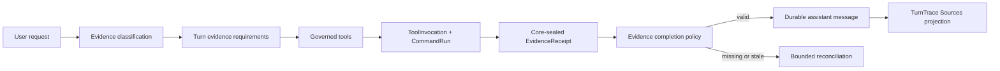

# Fairy V3 Evidence-First Agent Design

**Status:** Accepted implementation specification

**Date:** 2026-08-06

## Purpose

Fairy already owns a governed Tool Registry, Command Bus, approvals, immutable Task Scope, durable
Tool Invocations, model routing, and restart recovery. This design closes the remaining trust gap:
a model can currently answer a question about live code or current external state without proving
that it inspected the relevant source.

The evidence-first layer makes tool use mandatory only when the answer depends on current state.
It reuses the existing Turn, Scope, Command and Trace authorities instead of creating a second
ledger. Stable chat remains fast, while current facts fail closed when verification is impossible.

## Evidence flow

Auto routing emits a closed tuple of requirements. Manual routing performs one short classifier
call using the selected model, using structured output or a forced internal classification tool.
There is no natural-language keyword router. Invalid or unavailable classification fails closed.

The requirement kinds are `workspace_structure`, `workspace_content`, `web_current`,
`runtime_current`, and `private_current`. A Turn may require more than one kind.

## Receipt authority

Capability executors return Evidence Drafts describing only source-specific facts. Core seals a
Draft after successful command execution by adding the current Turn, Tool Invocation, Scope,
Version or Snapshot, revision, hashes, timestamps, expiry, and a safe public locator. Sealing and
Tool Invocation completion are one transaction.

Tool Invocation owns the immutable receipts. Assistant Turn stores the IDs selected by the final
`direct_answer`. Turn Trace projects the selected receipts into public Source models. Message
content remains unchanged, so old Messages and synchronization contracts remain compatible.

Receipt validation is exact and local: same Turn, same Scope digest, successful invocation,
matching authority revision, correct requirement kind, and not expired. No receipt is reused
across Turns. Historical Sources remain an audit of what was current when the answer completed;
expiry only prevents new completion.

Public Source metadata is limited to relative Workspace paths, safe line ranges, sanitized HTTPS
origins, public labels, observation time, and non-secret authority labels. Credentials, URL user
info and sensitive queries, absolute device paths, source bodies, screenshots, model prompts, and
hidden reasoning never enter a receipt.

## Completion policy

For a Turn with requirements, the offered `direct_answer` schema requires both the answer and a
bounded list of receipt IDs. Ordinary text completion is rejected. Core checks that the cited set
covers every requirement before committing the assistant Message and final Turn state. Reviewer
models cannot replace the cited set with foreign or stale evidence.

The existing bounded completion reconciliation handles recoverable omissions. Repeating the same
evidence defect, exhausting model rounds, or losing an authority revision ends with a typed public
error. A deterministic recovery notice may suggest reconnecting a provider, refreshing a Runtime,
or retrying; it does not ask a model to invent an unverified substitute answer.

Workspace modification has a stronger invariant: every existing file in `execution.plan` must
have a same-Turn `project.read` receipt for the plan's exact content hash. Newly created files are
the only exception.

## Workspace discovery

`project.list` exposes a stable, paginated projection of the Task-bound Project Index.
`project.search` performs bounded literal UTF-8 search over authorized indexed files. Both bind
their cursors to Version, Index generation, Scope and query digest, and revalidate files through
PathGuard and read leases. Binary, oversized, stale, linked, or unindexed content is never
silently treated as evidence.

`terminal.inspect` is a complementary expert tool, not a host shell. It runs one validated argv
inside the attested FairySandbox against a read-only immutable archive with no network. The first
release permits safe subsets of ripgrep and basic read-only file inspection programs. Every path
operand is Workspace-relative, and shell evaluation, interpreters, preprocessors, services,
watchers, environment injection, and host paths are rejected.

The Sandbox protocol gains an `inspect` purpose and an attested Runner upgrade. Existing installs
are upgraded atomically; failure leaves the old Runner usable for existing capabilities while the
new tool reports unavailable.

## Source presentation

The Activity Rail exposes classification, source inspection and evidence validation as concise
public work stages. A completed assistant reply shows a collapsed `Sources · N` footer derived
from its Turn Trace. Expanding it reveals safe source labels and observation metadata.

Workspace links open the immutable Version originally cited, never the current file by accident.
Web links pass through the existing safe HTTPS opener. Runtime and private Sources open their
governed Inspector surface. Missing historical material disables the target with an explanation.
Keyboard navigation, reduced motion, narrow layouts and rapid conversation switching preserve the
same scope isolation as Messages and Turn Traces.

## Explicit exclusions

- No parallel tool scheduler in this change.
- No arbitrary host PowerShell, cmd, bash, script interpreter, pipe, redirection, or shell string.
- No independent Evidence Ledger and no cross-Turn Evidence cache.
- No claim-level natural-language entailment or hidden reasoning verifier.
- No richer Browser action surface beyond evidence from existing governed state and snapshots.
- No release, Docker, or production-image build during ordinary development verification.

